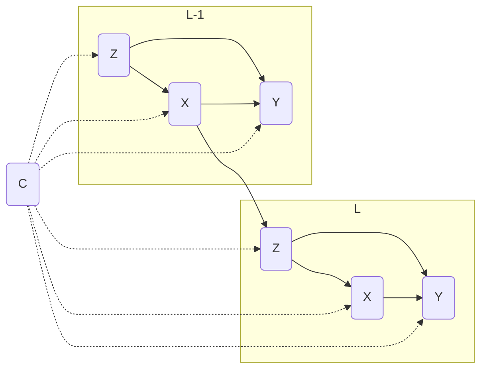

# survivl

This package allows for simulation of survival data from additive hazard and Cox Marginal Structural Models.

Current features:

-   Simulation of Cox MSM survival models.

To install and load the package, run the commands

```         
install.packages("devtools")
devtools::install_github("rje42/causl") # dependency
devtools::install_github("rje42/survivl")
library(survivl)
```

## Example:



One example of the preceding graph would be to set our background covariates $C = \text{Bern}(\text{expit}(0.5))$. We can set 
$Z_{L} \mid X_{L-1}, C \sim N(-\frac{1}{2} + \frac{1}{2} X_{L-1} - \frac{1}{2}C)$ and 
set $X_{L} \mid Z_{L}, C \sim \text{Bern}\left(\text{expit}(\frac{1}{2}* Z_{L} + \frac{1}{10}C)\right)$.

Then, we can set $Y_{L} \mid do(X_{L}), C \sim \text{Exp}\left(\left(0.05 + 0.5 * X_{L} + 0.05 * C\right)^{-1}\right)$.

Finally,we set a Gaussian copula between $Y_L, Z_L$ to have correlation $0.4 = 2 * \text{expit}(0.85) - 1$

You can simulate from the graph for 20 time steps as follows:

```
formulas <- list(C ~ 1,
                 Z ~ X_l1 + C,
                 X ~ Z_l0 + C,
                 Y ~ X_l0 + C,
                 cop ~ 1)
family <- list(5,1,5,3,1)
link <- list("logit", "identity", "logit", "inverse")
pars <- list(C = list(beta=0),
             Z = list(beta = c(-1/2,1/2,0.25), phi=0.5),
             X = list(beta = c(0,1/2,1/10)),
             Y = list(beta = c(0.05,0.5,0.05), phi=1),
             cop = list(beta=0.8472979))  # gives correlation 0.4

n <- 1e4

dat <- msm_samp(n, T=20, formulas=formulas, family=family, pars=pars, link=link)
```

